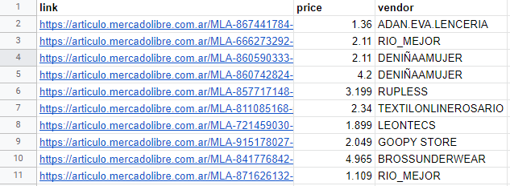

## MeLi Scraper

### Table of contents

- [Requirements](#requirements)
- [Usage](#usage)
- [Result](#result)

### Requirements

* Python 3.5+

Instalar los modulos extras con:

```shell
pip install -r requirements.txt
```

### Usage

```shell
$ python run.py -h
usage: run.py [-h] [--skip_sponsor] [--remove_tracking] keyword max_queries

positional arguments:
  keyword            Nombre del item/producto a buscar
  max_queries        Cantidad maxima a buscar

optional arguments:
  -h, --help         show this help message and exit
  --skip_sponsor     Saltear los productos sponsoreados
  --remove_tracking  Remover el tracking de la url a guardar
```

To scrape `10` publications of `boxer` run:

```shell
python run.py boxer 10
```

To skip ads/sponsored offers:

```shell
python run.py boxer 10 --skip_sponsor
```

### Result

